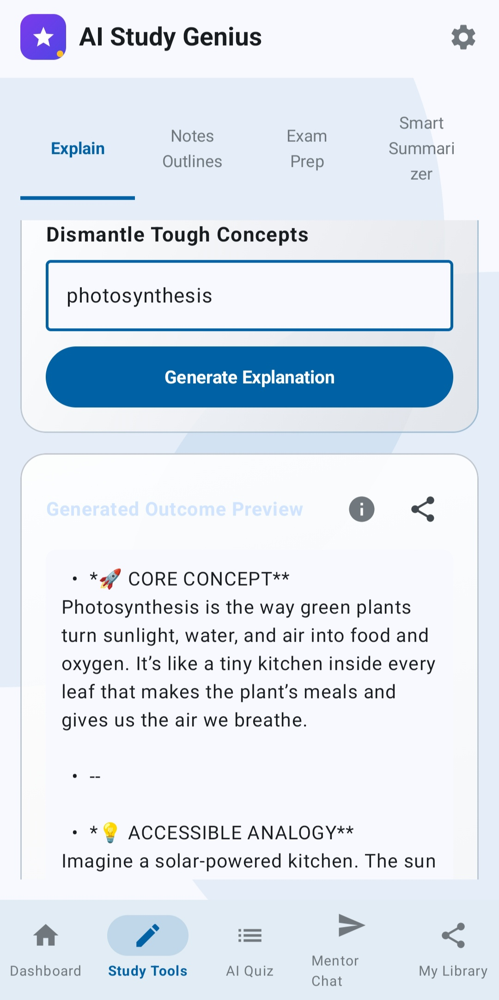
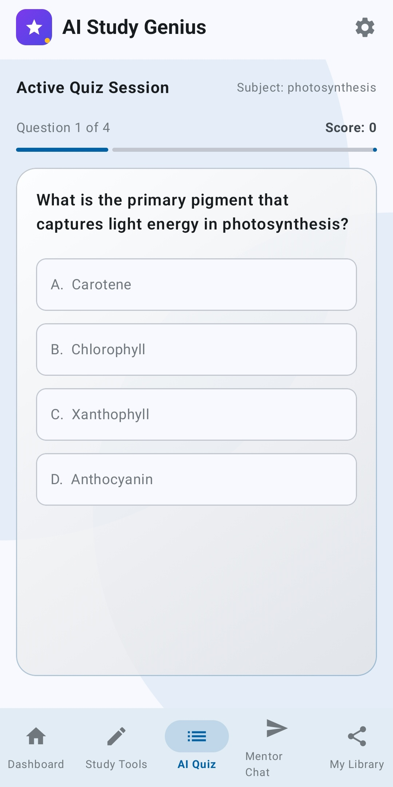
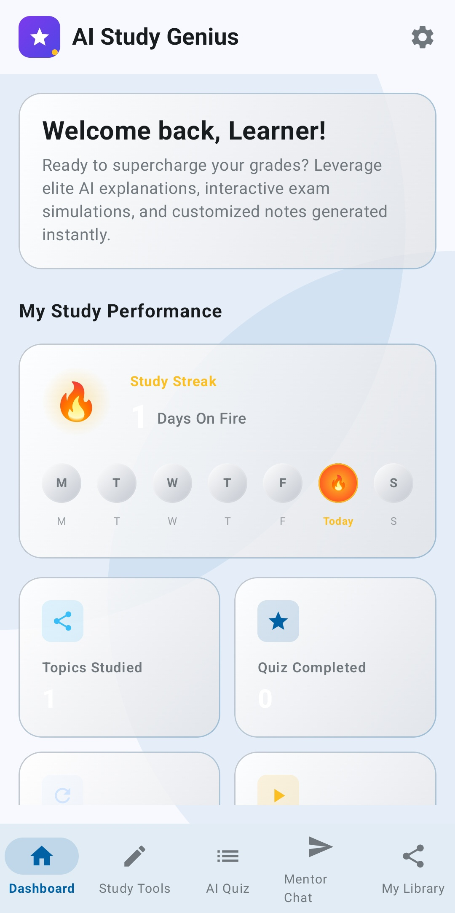

🚀 AI Study Genius
Your AI-powered reasoning-based learning companion for smarter exam preparation
🧠 Overview

AI Study Genius is an AI-powered Android learning assistant that transforms the way students study by converting any topic into structured, easy-to-understand learning material.

Instead of switching between multiple apps for notes, explanations, and quizzes, this app provides a single intelligent study system that adapts to the learner’s understanding level.

It generates:

Simplified explanations
Structured notes
Exam-focused summaries
Interactive quizzes with adaptive difficulty

The goal is to make learning faster, smarter, and more consistent using AI-driven reasoning.

✨ Key Features
🧠 AI Learning Engine
Converts any topic into structured educational content
Breaks complex concepts into simple explanations
Generates exam-ready notes instantly
📝 Interactive Quiz System
Multiple-choice quizzes generated dynamically by AI
Questions adjust based on user performance
Focuses on weak areas for better retention
📊 Progress Tracking
Tracks learning consistency
Visual progress insights for motivation
Encourages daily learning habits
🔁 Adaptive Difficulty System
Quiz difficulty automatically adjusts in real-time
Improves learning efficiency based on responses
Simulates a personalized tutor experience
⚡ Optimized User Experience
Built with Jetpack Compose (modern Android UI)
Smooth scrolling for long AI-generated content
Clean, distraction-free learning interface
🧠 Microsoft IQ Integration (Reasoning Layer)

AI Study Genius is designed to integrate with Microsoft Foundry IQ as its reasoning intelligence layer.

How Foundry IQ enhances the system:
🧩 Structured Reasoning for Learning Paths
Converts raw AI output into step-by-step educational flow instead of unstructured text.
🎯 Improved Quiz Generation Logic
Ensures questions follow logical difficulty progression (basic → intermediate → advanced).
📚 Context-Aware Explanations
Maintains continuity between topics for better conceptual understanding.
🔄 Reliable AI Fallback Reasoning
Ensures consistent output even when AI responses vary or fail.

👉 This transforms the app from a simple AI generator into a reasoning-based AI tutor system.

🛠 Tech Stack
Kotlin (Android Development)
Jetpack Compose (UI Framework)
Android SDK
AI APIs (Gemini / OpenRouter)
Gradle Build System
🎯 Core Vision

The goal of AI Study Genius is to eliminate fragmented learning tools by combining everything into one intelligent system:

✔ AI tutor
✔ Notes generator
✔ Quiz trainer
✔ Progress tracker

All in a single Android application designed for exam preparation efficiency.

📸 Screenshots

    

📦 Installation
Download the APK from this repository
Install it on an Android device
Open the app and start learning instantly
Enter any topic and generate AI-powered study material
👨‍💻 Developer

Rudransh Sharma

Built for:
🎯 Agents League Hackathon 2026

📌 Note

AI Study Genius demonstrates how AI reasoning systems can be applied to education by combining structured learning, adaptive quizzes, and intelligent content generation into a single mobile experience.

🏁 Final Statement

This project is designed not just as a study app, but as a personal AI learning companion that adapts, reasons, and improves with the learner.
